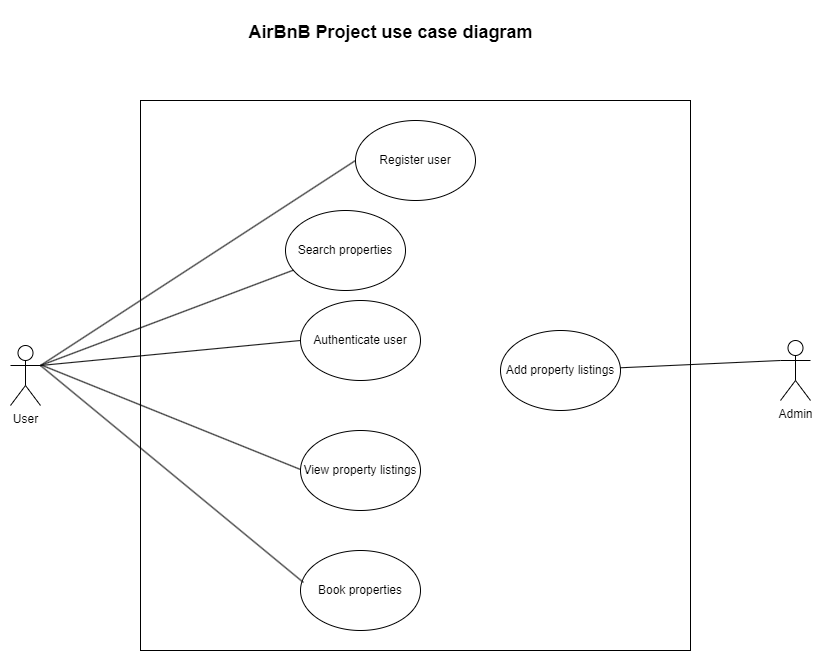

# Requirement Analysis in Software Development

This repository is a detailed overview of the all the requirements of the [Air BnB project](https://github.com/AckimJnr/airbnb-clone-project)

---

## What is Requirement Analysis?
Requirements analysis is a phase in the software development lifecycle (SDLC) where a project team gathers, analyses and defines the needs of the software product to be developed.

This is a crucial step in software development as it helps all stake holders to have a mutual understanding of what the system will do and how it will perform.

---

## Why is Requirement Analysis Important?
The following are the benefits of requirements analysis:
- **Cost & time estimation:** Helps accurate budgeting before a project is put in motion
- **Clarity & understanding:** I helps in elaborating what both the developers and the endusers should expect the developed software to be doing.
- **Scope definition:** It clearly defines a project's duration and resources required preventing scope creep.
- **Basis for design and development:** Provides a solid foundation for system design and development.
- **Quality Assurance:** Ensures that the final product meets specified requirements for quality user satisfaction.

---

## Key Activities in Requirement Analysis  

### Requirement Gathering  
- **Interviews**: Conduct one-on-one sessions with stakeholders to identify their needs and expectations.  
- **Surveys/Questionnaires**: Distribute structured forms to collect input from a larger audience.  
- **Workshops**: Organize group discussions with stakeholders to align and gather requirements.  
- **Observation**: Observe end-users in their working environment to understand their workflows.  
- **Document Analysis**: Review existing documentation and systems to identify current functionalities and gaps.  

### Requirement Elicitation  
- **Brainstorming**: Conduct group sessions to generate ideas and capture diverse requirements.  
- **Focus Groups**: Hold discussions with selected stakeholders for detailed insights.  
- **Prototyping**: Create visual or functional prototypes to refine and validate requirements.  

### Requirement Documentation  
- **Requirement Specification Document**: Prepare a detailed document listing all functional and non-functional requirements.  
- **User Stories**: Write narrative descriptions to represent functionalities from the user’s perspective.  
- **Use Cases**: Develop diagrams to illustrate interactions between users and the system.  

### Requirement Analysis and Modeling  
- **Requirement Prioritization**: Rank requirements by importance and project impact.  
- **Feasibility Analysis**: Evaluate technical, financial, and time constraints of the requirements.  
- **Modeling**: Use tools like data flow diagrams or entity-relationship diagrams to represent and analyze requirements.  

### Requirement Validation  
- **Verification**: Ensure requirements are complete, consistent, and clear.  
- **Stakeholder Review**: Present requirements to stakeholders for approval and feedback.  
- **Traceability**: Map requirements to ensure alignment with project goals and objectives.  

---

## Types of Requirements  

### Functional Requirements ⚙️  
- **Definition**: Describe what the system should do.  
- **Examples**: User authentication, property search, booking system, user registration.  

#### Key Functional Requirements:  
- **Search Properties**: Enable users to search for properties based on location, price, and availability.  
- **User Registration**: Allow new users to create accounts with personal details and login credentials.  
- **Property Listings**: Display property details, including images and essential information.  
- **Booking System**: Provide functionality for booking properties, viewing booking details, and managing bookings.  
- **User Authentication**: Ensure secure login and registration processes for all users.  

### Non-functional Requirements 🛡️  
- **Definition**: Describe how the system should perform.  
- **Examples**: Performance, security, scalability, usability, reliability.  

#### Key Non-functional Requirements:  
- **Performance**: Pages should load within 2 seconds and support up to 1000 concurrent users.  
- **Security**: Implement data encryption, secure logins, and protection against vulnerabilities.  
- **Scalability**: Ensure the system can scale horizontally to handle increased traffic.  
- **Usability**: Design an intuitive UI/UX for easy navigation and task performance.  
- **Reliability**: Maintain 99.9% uptime and enable quick recovery from failures.  

---

## Use Case Diagrams 📊  

### Objective  
Illustrate the use of Use Case Diagrams in Requirement Analysis.  

### What are Use Case Diagrams?  
Use Case Diagrams provide a visual representation of interactions between users (actors) and the system to achieve specific goals (use cases). They depict how different user roles engage with various system functionalities.  

### Creating Use Case Diagrams  
1. **Identify Actors**: Determine the users or roles interacting with the system (e.g., guest, registered user, admin).  
2. **Define Use Cases**: List the actions or goals users aim to accomplish (e.g., search properties, book property, manage listings).  
3. **Draw Interactions**: Illustrate the relationships between actors and use cases to show how users achieve their goals.  

### Benefits of Use Case Diagrams  
- **Visual Clarity**: Provide a clear, graphical representation of system functionalities and user interactions.  
- **Requirement Organization**: Help identify and structure system requirements effectively.  
- **Enhanced Communication**: Serve as a common language for stakeholders and the development team, improving collaboration.  

---

### Airbnb project Use case diagram

---